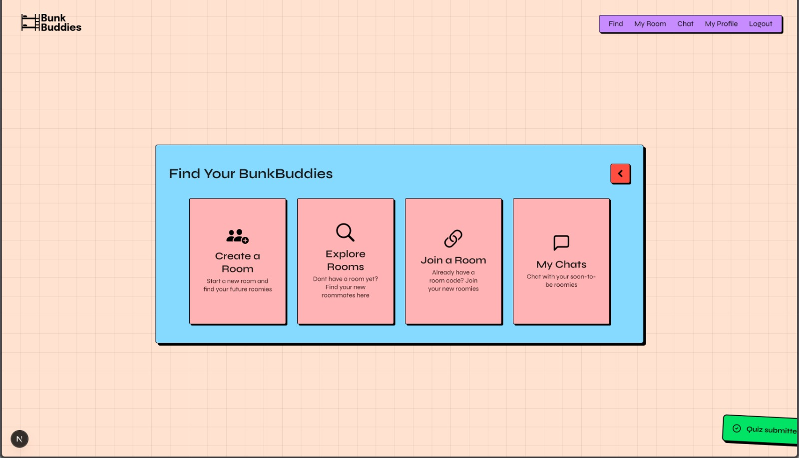
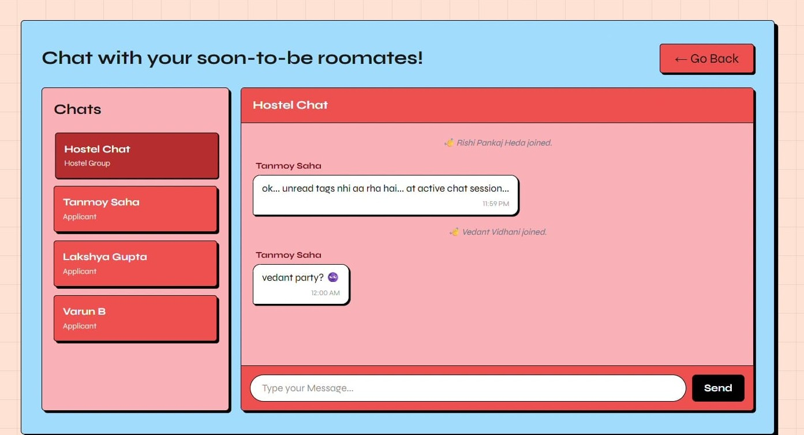

<a id="readme-top"></a>


<!-- Club Logo -->
<br />
<div align="center">
  <a href="https://github.com/vinnovateit/BunkBuddies-Backend">
    <picture>
      <source media="(prefers-color-scheme: dark)" srcset="https://raw.githubusercontent.com/vinnovateit/.github/main/assets/whiteLogoViit.svg">
      
    </picture>
  </a>

<h3 align="center">BunkBuddies</h3>

  <p align="center">
    Web application for finding roomates during VIT hostel counselling
    <br />
    <br />
    <br />
    <a href="https://github.com/vinnovateit/BunkBuddies-Backend">Visit</a>
    &middot;
    <a href="https://github.com/vinnovateit/BunkBuddies-Backend/issues/new?labels=bug&template=bug-report---.md">Report Bug</a>
    &middot;
    <a href="https://github.com/vinnovateit/BunkBuddies-Backend/issues/new?labels=enhancement&template=feature-request---.md">Request Feature</a>
  </p>
</div>


<!-- TABLE OF CONTENTS -->
<!-- Use if things get too long -->
<!-- <details>
  <summary>Table of Contents</summary>
  <ol>
    <li>
      <a href="#about-the-project">About The Project</a>
      <ul>
        <li><a href="#built-with">Built With</a></li>
      </ul>
    </li>
    <li><a href="#roadmap">Roadmap</a></li>
    <li>
      <a href="#getting-started">Getting Started</a>
      <ul>
        <li><a href="#prerequisites">Prerequisites</a></li>
        <li><a href="#installation">Installation</a></li>
      </ul>
    </li>
    <li><a href="#usage">Usage</a></li>
    <li><a href="#acknowledgments">Acknowledgments</a></li>
  </ol>
</details> -->


<!-- ABOUT THE PROJECT -->
## About The Project

<!-- Put the PROJECT LOGO here -->
<picture>
  <source media="(prefers-color-scheme: dark)" srcset=".github/assets/bb_logo_white.svg">
  
</picture>


BunkBuddies is a web application developed by VinnovateIT that helps in selecting roommate for VIT hostel counseling. It leverages Natural Language Processing to generate compatibility scores and rank potential roommates. It features private and public chats to facilitate seamless communication between VIT students.

<!-- Put appropriate SCREENSHOTS here
Use width modifier to control size
Use wisely: don't overfill & don't use too heavy imgs
-->
<details>
  <summary><b>Screenshots</b></summary>
  
  | Dashboard | Create Room |
  | :--------------: | :--------: |
  |  |  |
  | **Explore Rooms** | **Chat** |
  |  |  |

</details>

### Built With

[![Python][Python.org]][Python-url]
[![FastAPI][FastAPI.tiangolo.com]][FastAPI-url]
[![MongoDB][MongoDB.com]][MongoDB-url]
[![HTML5][HTML5.com]][HTML5-url]


<!-- GETTING STARTED -->
## Getting Started

To get a local copy up and running follow these simple steps.

### Prerequisites

Before you begin, ensure you have the following installed on your system:

* **Python (3.8 or higher):** Required to run the backend and NLP compatibility models.
* **MongoDB:** A local installation or an active MongoDB Atlas URI for the database.
* **Git:** For cloning the repository and version control.
* A modern web browser (Chrome, Edge, Firefox, etc.).

### Installation
1. Clone the repo
   ```sh
   git clone https://github.com/vinnovateit/BunkBuddies-Backend.git
   ```
2. Install the required libraries using the requirements.txt
   ```sh
   pip install -r requirements.txt
   ```
3. Go to [MongoDB Atlas](https://www.mongodb.com/cloud/atlas) and create a cluster and get a connection string URL for it and store it in the .env file
   ```sh
   MONGODB_URI = YOUR-CONNECTION-URL-HERE
   ```
4. Go to [Google Cloud Console](https://console.cloud.google.com/) and get a Google client ID and the secret key for it and store them in the .env file
   ```sh
   GOOGLE_CLIENT_ID = YOUR-GOOGLE-CLIENT-ID-HERE
   GOOGLE_CLIENT_SECRET = YOUR-GOOGLE-SECRET-KEY-HERE
   ```
5. Enter your full gmail address in mail username and mail from and Go to [Google Security Settings](https://myaccount.google.com/security) and generate a 16 letter App Password and store it in the .env file
   ```sh
   MAIL_USERNAME = your_mail@gmail.com
   MAIL_FROM = your_mail@gmail.com
   MAIL_PASSWORD = 16-Letter-App-Password
   ```
6. Go to [Hugging Face](https://huggingface.co/settings/tokens) and generate a token API Key and store it in .env file
   ```sh
   HUGGINGFACE_API_KEY = hf-your-long-token-here
   ```


<!-- USAGE - REMOVE IF NOT NEEDED -->
## Usage

BunkBuddies uses natural language processing to match you with the most compatible roommates based on your living habits, schedules, and lifestyle preferences. It streamlines the hostel counseling experience by allowing you to filter rooms by specific blocks and ac prefrences. It also verifies student credentials and facilitates secure in-app messaging, allowing you to connect confidently before making a final decision.


### Top contributors:

<a href="https://github.com/vinnovateit/BunkBuddies-Backend/graphs/contributors">
  
</a>


<!-- ACKNOWLEDGMENTS -->
## Acknowledgments

- [VinnovateIT Family](https://vinnovateit.com) for mentoring and resources
- A huge thank you to the open-source community behind the core stack: [FastAPI](https://fastapi.tiangolo.com/) & [Pydantic](https://docs.pydantic.dev/) (Backend), [Motor](https://motor.readthedocs.io/)/[PyMongo](https://pymongo.readthedocs.io/) (Database), [WebSockets](https://websockets.readthedocs.io/) (Real-time features), and [Authlib](https://docs.authlib.org/)/[PyJWT](https://pyjwt.readthedocs.io/) (Security).


<p align="center">
	Made with :heart: by <a href="https://vinnovateit.com">VinnovateIT</a>
</p>


<!-- MARKDOWN LINKS & IMAGES -->
<!-- https://www.markdownguide.org/basic-syntax/#reference-style-links -->
[Python.org]: https://img.shields.io/badge/python-3670A0?style=for-the-badge&logo=python&logoColor=ffdd54
[Python-url]: https://www.python.org/
[FastAPI.tiangolo.com]: https://img.shields.io/badge/FastAPI-009485?style=for-the-badge&logo=fastapi&logoColor=white
[FastAPI-url]: https://fastapi.tiangolo.com/
[MongoDB.com]: https://img.shields.io/badge/MongoDB-%234ea94b.svg?style=for-the-badge&logo=mongodb&logoColor=white
[MongoDB-url]: https://www.mongodb.com/
[HTML5.com]: https://img.shields.io/badge/html5-%23E34F26.svg?style=for-the-badge&logo=html5&logoColor=white
[HTML5-url]: https://developer.mozilla.org/en-US/docs/Web/HTML
